# Daily Words

> A digital rebuild of a pocket vocabulary card.

The original was a 13×8 cm card carried in a trouser pocket, holding a short list
of unknown words and their meanings, glanced at through the day. This app
replicates that ritual and improves on it — because it is digital, and we can
change it as easily as flipping the back of our hand.

Phone-first, iOS Safari specifically. One device held in one hand. Live at
**[dword.site](https://dword.site)**.

Six words a day, and **nothing is generated until you press the button** — no
cron, no creation on page load, no card waiting for you when you open the app.
The press is the exercise:

<p align="center">
  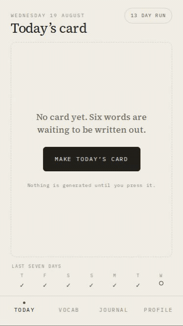
</p>

<p align="center"><em>Real capture: one real <code>POST /api/cards</code> against a seeded account. The six words are drawn from the collection by least-recently-shown, and the two badges under the card were earned by that press.</em></p>

---

## Demo

Everything below is the running app at **375×667** — the iPhone SE 3rd gen the
layout budget was measured against, which is also `playwright.config.ts`'s `se3`
project — with a seeded account. `docs/media/README.md` says how to reproduce it.

<table>
<tr>
<td width="33%" align="center">
  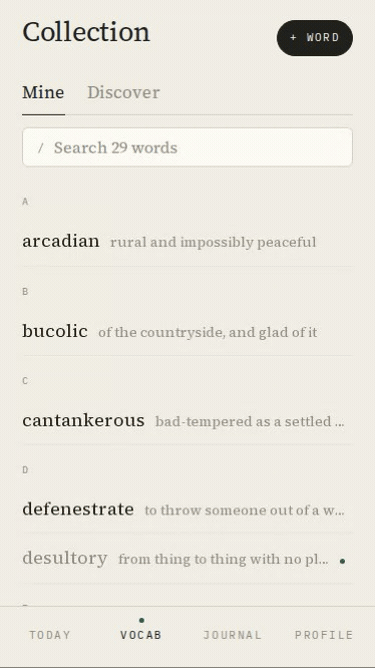
  <br><strong>Search by meaning</strong><br>
  <sub>Typing issues no request at all.<br>“shadow” finds <em>penumbra</em> by its definition.</sub>
</td>
<td width="33%" align="center">
  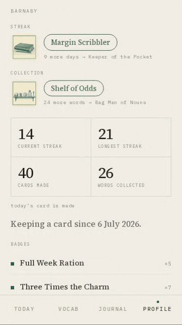
  <br><strong>Levels and badges</strong><br>
  <sub>One <code>&lt;dialog&gt;</code> for both.<br>Seventeen panels, twenty-one medals.</sub>
</td>
<td width="33%" align="center">
  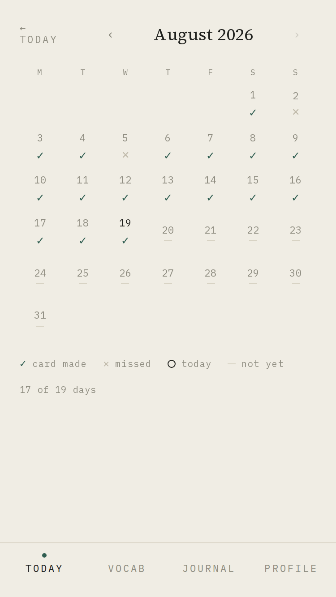
  <br><strong>The record</strong><br>
  <sub>Ticks, crosses, and the days<br>that have not happened yet.</sub>
</td>
</tr>
<tr>
<td width="33%" align="center">
  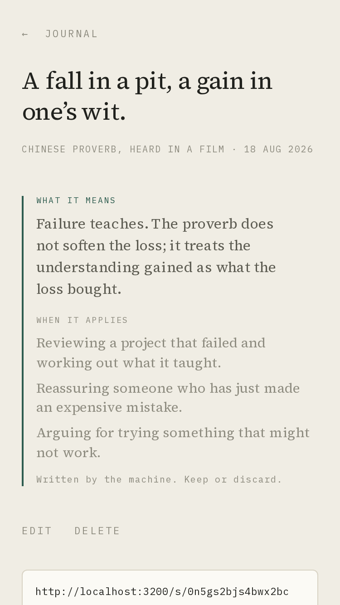
  <br><strong>Journal</strong><br>
  <sub>The insight is generated once,<br>by an explicit tap. Never on load.</sub>
</td>
<td width="33%" align="center">
  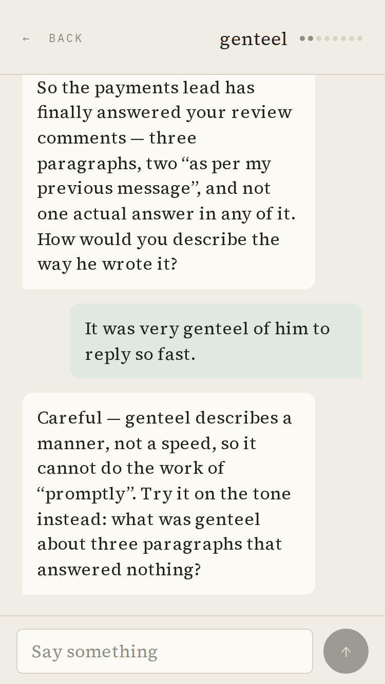
  <br><strong>Practice</strong><br>
  <sub>The model speaks first, in role.<br>Eight turns, then a verdict.</sub>
</td>
<td width="33%" align="center">
  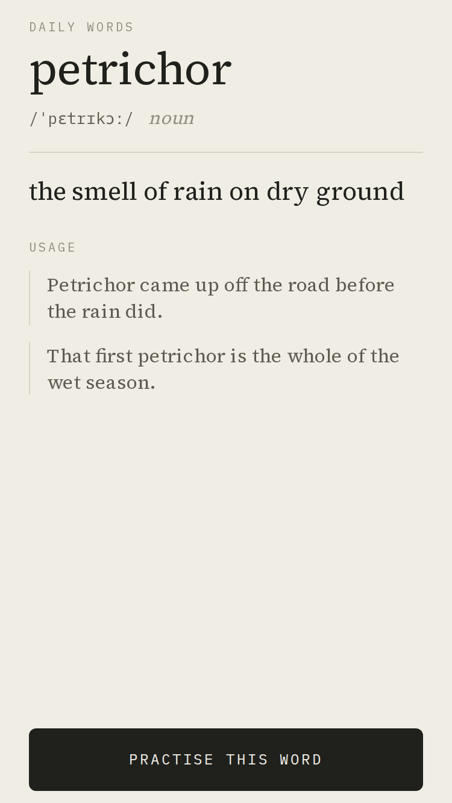
  <br><strong>Shared, no session</strong><br>
  <sub><code>/s/[slug]</code> — 80 bits of slug<br>is the whole capability.</sub>
</td>
</tr>
</table>

<details>
<summary>The collection, a word, Discover, a past card, a claimed non-English lookup, and dark mode</summary>
<br>
<p align="center">
  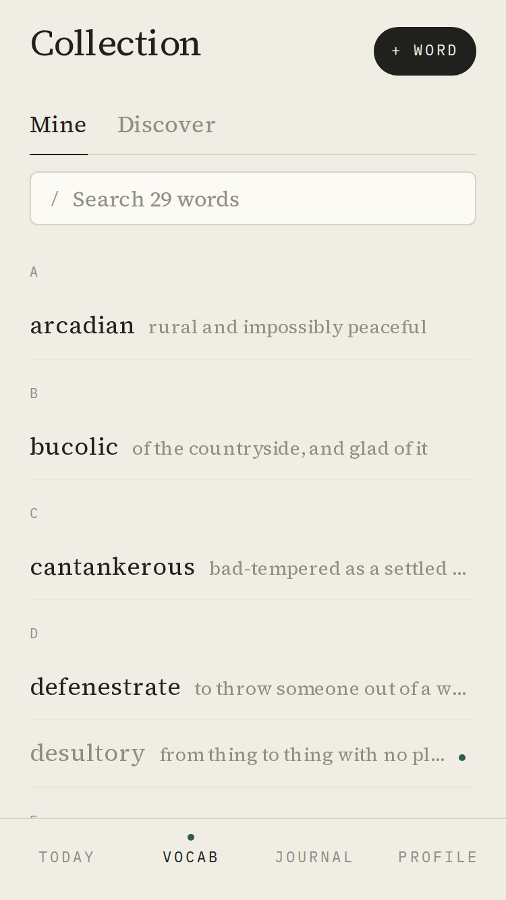
  &nbsp;&nbsp;
  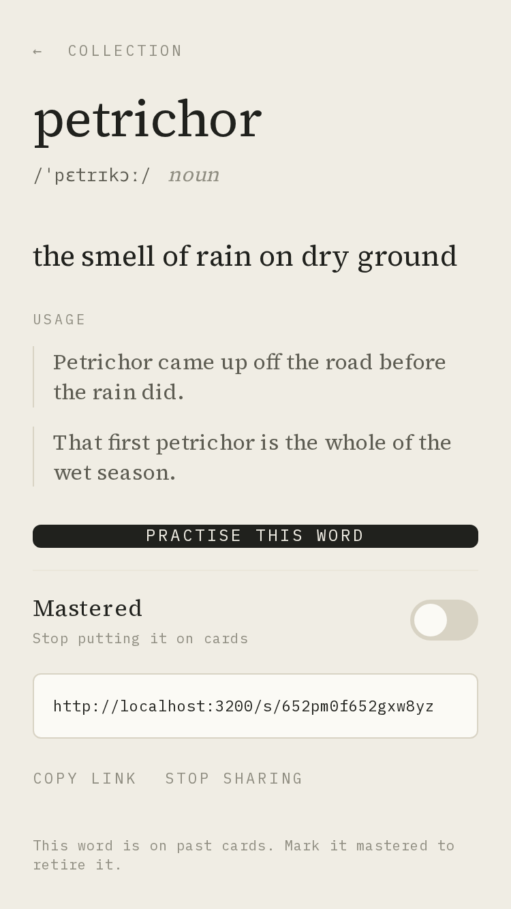
  &nbsp;&nbsp;
  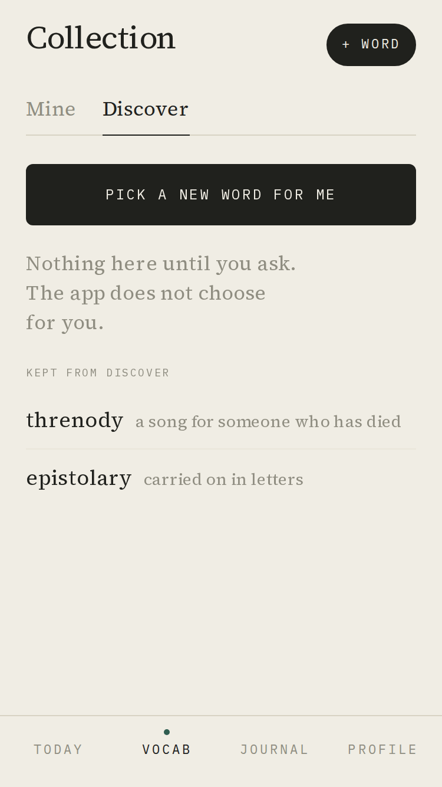
</p>
<p align="center">
  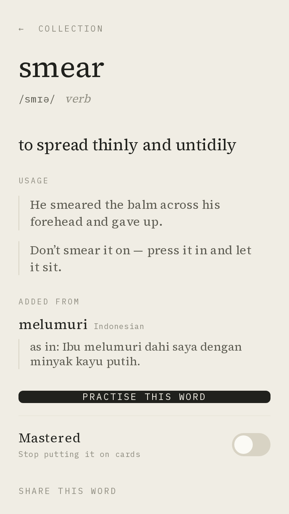
  &nbsp;&nbsp;
  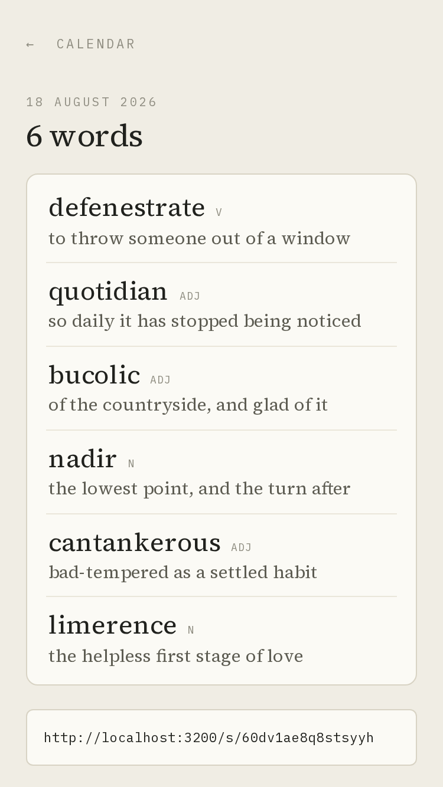
  &nbsp;&nbsp;
  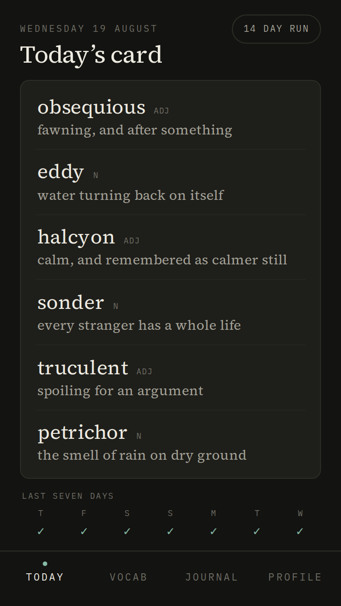
</p>
<p align="center">
  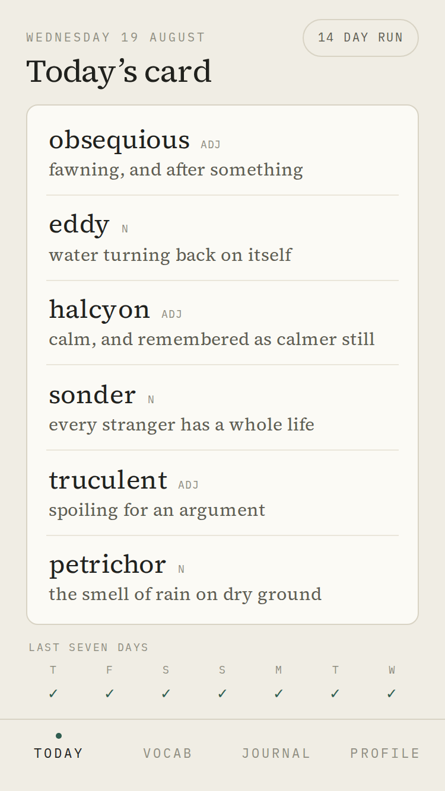
  &nbsp;&nbsp;
  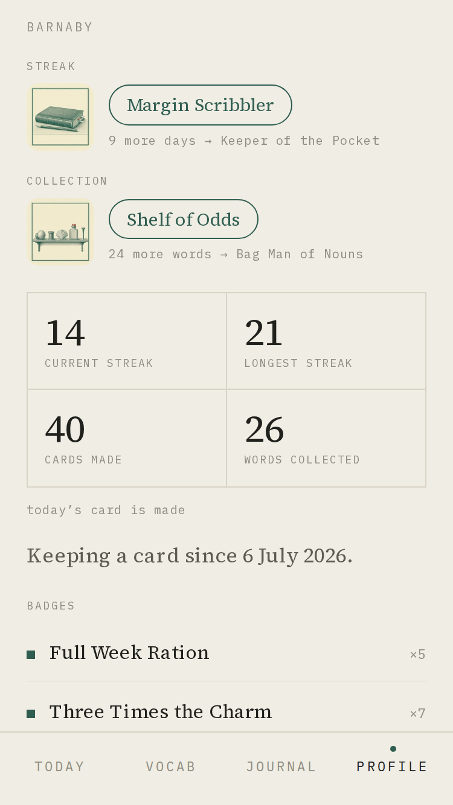
  &nbsp;&nbsp;
  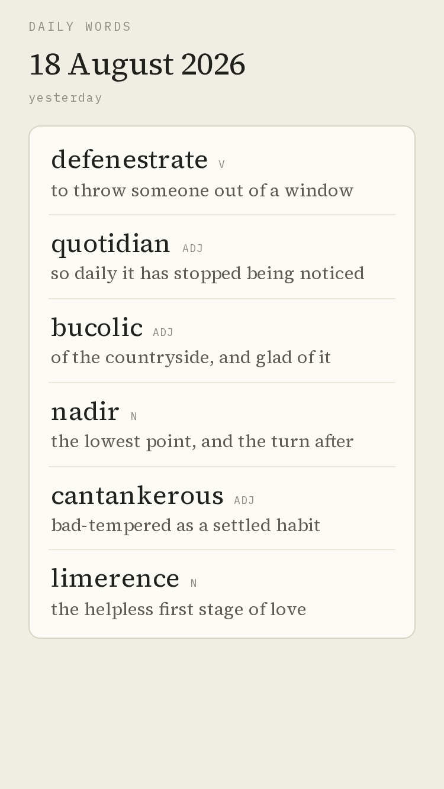
</p>
<p align="center"><em>Dark comes from <code>prefers-color-scheme</code>. There is no toggle, on purpose.</em></p>
</details>

---

## What it does

| Screen | What happens there |
|---|---|
| `/today` | The daily card: six words, two lines each, **never scrolls**. Created only when the user presses the button — no cron, no generation on page load. |
| `/calendar`, `/card/[date]` | Ticks and crosses for the days that have a card, and any past card in full. |
| `/vocab` | The collection. **Mine** searches in the browser; **Discover** asks the model for a word the user does not already have. |
| `/vocab/new` | Add a word. One model call validates the term, corrects likely typos (`genteell` → *genteel*), and returns part of speech, pronunciation, a one-line definition and examples — all persisted on write. |
| `/vocab/[id]/chat` | Proactive practice. The model speaks first, in role, with a scenario drawn from the user's profile, and steers them into using the word. Capped at eight turns, closing with a verdict. |
| `/journal`, `/journal/[id]` | Paste a line worth keeping — *"a fall in a pit, a gain in one's wit"* — and ask, by an explicit tap, for an insight on its meaning and the situations it fits. Near-duplicates warn; they never block. |
| `/profile` | Streaks, streak and collector levels with their illustrations, and twenty-one badges with their medals. |
| `/s/[slug]`, `/s/[slug]/[1..6]` | Public share pages for a word, a daily card, one word of a card, or a journal entry. No session required. |
| `/s/[slug]/claim` → `/claim` | A stranger follows a shared word, signs in with Google, and the word is theirs — with the sharer's enrichment copied and zero model calls. |
| `/onboarding` | Five questions, one per screen, every one skippable. Timezone is detected, never asked. |

Everything the model writes is persisted. No screen makes a live LLM call on
page load.

## Stack

| Concern | Choice |
|---|---|
| Framework | Next.js 15, App Router, React 19, TypeScript |
| Runtime | Node 20.11+ (`engines`); Vercel currently builds on 24 |
| Styling | Tailwind CSS v4, no component library — the kit is in `src/components/` |
| Auth | Auth.js v5, **Google only**, database sessions via the Drizzle adapter |
| Database | Neon Postgres (free tier) + pgvector |
| ORM | Drizzle ORM + drizzle-kit |
| LLM | GLM via z.ai, through the official `@anthropic-ai/sdk` with `baseURL` overridden |
| Embeddings | OpenAI `text-embedding-3-small`, optional |
| Validation | zod 4, at every API boundary |
| Hosting | Vercel (free tier) |

Free tier forever is a product constraint, not an accident. There are no paid
dependencies.

## Getting started

```bash
npm install
cp .env.example .env.local     # then fill it in — read the comments, they matter
npm run db:migrate
npm run dev                    # http://localhost:3200
```

**Port 3200 is the only port.** `dev`, `start` and the Playwright `baseURL` are
all hardwired to it. If something is already listening, kill it by pid
(`ss -ltnp | grep 3200`) rather than picking a fresh port — a leftover production
`next start` on 3200 gets reused by the test suite, `/kitchen-sink` is gated off
in production, and the whole layout suite fails with a misleading timeout that
looks like a regression.

### Environment

Required: `DATABASE_URL` (the **pooled** Neon host), `AUTH_SECRET`,
`AUTH_GOOGLE_ID`, `AUTH_GOOGLE_SECRET`, `LLM_BASE_URL`, `LLM_MODEL`,
`LLM_API_KEY`. `src/lib/env.ts` parses them with zod and throws at startup if
one is missing, so a misconfiguration is a boot failure rather than a 500 later.

Optional, all with defaults: `DATABASE_URL_UNPOOLED` (migrations only),
`APP_URL`, `CHAT_MAX_NEW_ROUNDS_PER_DAY`, and the three `EMBEDDING_*` variables.
Without an embedding key the app boots, builds and saves normally — the journal's
hash layer needs no provider, and a missing key degrades semantic dedup to "not
checked", never to a failed save. CI has no key.

`glm-4.6` and `glm-5.2` are both verified working as `LLM_MODEL`.

### Migrations

```bash
npm run db:generate     # after editing src/lib/db/schema.ts
npm run db:migrate
```

**Never run `db:push` on this schema.** `CREATE EXTENSION vector` lives in a
hand-written migration (`drizzle/0004_enable_pgvector.sql`) because extensions
are invisible to drizzle's differ, and `push` skips it — and the journal
embeddings table with it.

Fifteen tables: the four Auth.js ones, `profiles`, `vocab_entries`,
`daily_cards`, `daily_card_items`, `chat_sessions`, `chat_messages`,
`journal_entries`, `journal_entry_embeddings`, `user_stats`, `badges_awarded`,
`shares`. The authoritative definition is `ROADMAP_v0.1.0.md` § Database schema;
`src/lib/db/schema.ts` is its implementation.

## Commands

```bash
npm run dev            # 3200
npm run typecheck      # tsc --noEmit
npm run lint
npm run build
npm run test:layout    # Playwright, boots its own dev server on 3200

npm run demo:seed      # the demo account the README's media was shot against
npm run demo:capture   # rewrite docs/media/* from the running app
```

`demo:seed` and `demo:capture` are the only two scripts here that exist for the
documentation rather than for the app; `docs/media/README.md` is the long
version, including why they photograph the real screens rather than
`/kitchen-sink`'s deliberately hostile fixtures.

Beyond that, each feature ships its own verification script, and the suffix says
what it costs:

| Suffix | Costs | Example |
|---|---|---|
| `:check` | nothing — offline, no database, no network | `npm run stats:check` |
| `:db` | a Neon round trip; seeds a fixture user and cleans up after itself | `npm run share:db` |
| `:dry-run` | real model calls, no writes; **the output is the deliverable** | `npm run journal:dry-run -- --all` |

The full list is in `package.json`; `CLAUDE.md` § Commands annotates every one of
them with what it actually proves. The ones worth knowing about on day one:

```bash
npm run llm:check                    # smoke-test z.ai through the shared client
npm run badges:check                 # both art manifests, files, hashes and the key scan
npm run stats:check                  # streaks, levels, badges, reveal queue
npm run stats:recompute -- --all --dry-run
```

`stats:recompute --prune` is the only destructive operation in the app and
refuses to combine with `--all` without `--force`.

## Testing

There is no unit-test framework. Verification is split three ways, deliberately:

- **`tsc`** carries the parity guards. `BADGE_ART` and `LEVEL_ART` are total
  `Record`s, so a badge or level tier with no art is a type error.
- **The `scripts/check-*.ts` family** drives the pure logic — date arithmetic,
  streaks, dedup folds, prompt assembly, the share allowlists — offline, in
  seconds, with no fixtures to maintain.
- **Playwright** (`tests/e2e/`) owns what only a browser can answer: that the
  daily card does not scroll. Two viewports — `se3` at 375×667, the design
  target, and `se1` at 320×568, the smallest screen iOS Safari still runs on,
  where the layout is asked to *degrade* rather than hold. WebKit is behind
  `PW_WEBKIT=1` because its system libraries need root.

Two specs write, and both skip without a session token:

```bash
DW_TEST_SESSION=<your authjs.session-token> npm run test:layout
```

Auth.js uses database sessions here, so a signed-in browser is just a row: seed a
user with `profiles.onboarded_at` set, insert a `sessions` row, and hand the token
to Playwright. `scripts/profile-peek.ts` is the helper for poking at a real
profile.

## Repo layout

```
src/app/(app)/        authed routes; one requireOnboardedUser() in the group layout
src/app/s/            public share pages — a SIBLING of (app), not a member
src/app/claim/        the claim interstitial — also outside the group
src/app/onboarding/   likewise, or the guard becomes its own redirect loop
src/app/api/          route handlers; requireApiUser() + ok()/fail()
src/app/kitchen-sink/ dev-only component gallery; what the layout spec drives
src/components/       the frozen UI kit — README.md there is the contract
src/lib/db/queries/   every Drizzle query; userId is always the first parameter
src/lib/llm/prompts/  one prompt module per feature; no feature builds its own client
src/lib/time/         the only place Intl.DateTimeFormat is constructed
src/lib/{share,vocab,journal,gamification,chat,cards,profile}/
scripts/              the check / db / dry-run family
tools/                offline Python for badge and level art
assets/               art masters (PNG + .txt sidecar carrying the style version)
public/{badges,levels}/  promoted WebP, content-hashed, immutable for a year
drizzle/              migrations
plans/, design/       feature plans and the visual source of truth
```

## Conventions that are load-bearing

`CLAUDE.md` is the working notes and the long version — read it before changing
anything. The short version:

- Database columns `snake_case`, TypeScript `camelCase`.
- All Drizzle access goes through `lib/db/queries/<resource>.ts`. `userId` is the
  first parameter and appears in every WHERE clause. **One function in the
  application reads a row without a user id** — `getShareBySlug`, whose caller is
  a stranger, and what replaces the user id there is 80 bits of CSPRNG output.
- Every "day" boundary is computed in the user's timezone, through
  `lib/time/local-date.ts`. `date` columns are read and written as
  `'YYYY-MM-DD'` strings, never as JS `Date`s. Reads may fall back to a default
  zone; **writes may not** — `POST /api/cards` answers 409 rather than date a
  card by guesswork.
- `import 'server-only'` at the top of everything under `lib/db/`, `lib/llm/` and
  `lib/env.ts`. It turns an API-key leak into a build error.
- Every LLM call goes through `lib/llm/`, one prompt module per feature, and
  exactly one repair retry — never a loop.
- A share is a snapshot addressed by a slug, never a live join. `lib/share/serialize.ts`
  is the one file that decides what a stranger sees.
- `user_stats` is a cache and is never displayed. Streaks decay with the passage
  of time and nothing writes on absence, so every consumer recomputes from
  `daily_cards` on read.
- There is no soft delete, and exactly one modal.

## Badge and level art

Two decks of raster art, generated offline and committed: twenty-one circular badge
**seals** and seventeen rectangular level **panels**, one per band in
`STREAK_LEVELS` and `COLLECTOR_LEVELS`. Both come out of the same pipeline —
`tools/gen_badge_art.py`, the `/generate-badge-art` skill, and a style contract
the generator *parses* (`style.md` for badges, `levels.md` for levels, selected by
`--kind`).

`OPENAI_API_KEY` is read by that tool and by **nothing else**: it is not in
`src/lib/env.ts`, and `grep OPENAI_API_KEY src/` must stay empty — a property
`npm run badges:check` asserts rather than trusts. It is a different key from
`LLM_API_KEY` (different provider, different bill) and a different key from
`EMBEDDING_API_KEY` (same provider, separate project, independently revocable).

Every promoted filename carries the first 8 hex of its master's SHA-256. That, and
only that, is what makes `immutable` for a year safe: regenerating an image changes
the bytes, the hash and the filename, so every cache misses correctly.

See `CLAUDE.md` § "Badge and level art" for the whole procedure, including what
adding a badge or a level tier costs.

## Documentation, in authority order

1. `ROADMAP_v0.1.0.md` § **Reconciliation Decisions** ([R1]–[R22]) — wins over
   everything, including the rest of that file.
2. `ROADMAP_v0.1.0.md` § Locked Decisions and § Database schema.
3. `design/from-claude-design/Daily Words.dc.html` — the visual source of truth
   for layout. Its *filler content* is not authoritative.
4. `src/components/README.md` — the frozen UI-kit contract. Read this, not
   `plans/F2-design-system.md`, which is substantially void.
5. `plans/F*.md` — written in parallel by agents that could not see each other.
   Each header lists which of its sections are superseded.

If a plan contradicts the roadmap, the roadmap wins. Stop and report the
discrepancy rather than guessing.

## Status

v0.1.0 (F1–F10) shipped and is deployed. F11–F22 followed: origin-aware back
navigation, the badge art skill and its detail dialog, vocab and journal
duplicate handling, sharing and claiming, instant collection search, and level
art.

Out of scope on purpose: any sign-in method other than Google, push
notifications, social features and leaderboards, audio pronunciation, imports
from Kindle or Goodreads, spaced repetition (the card is deliberately dumber than
SRS), offline caching beyond the bare PWA manifest, and any paid dependency.
